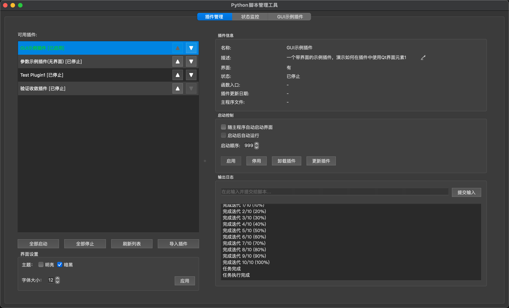
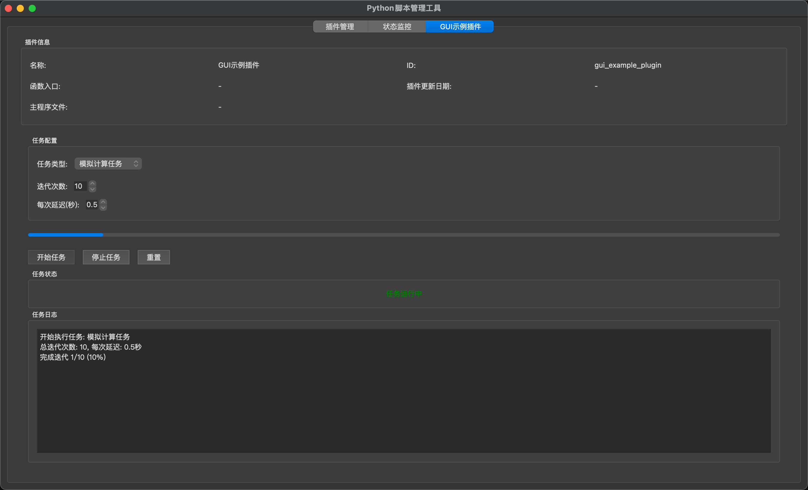
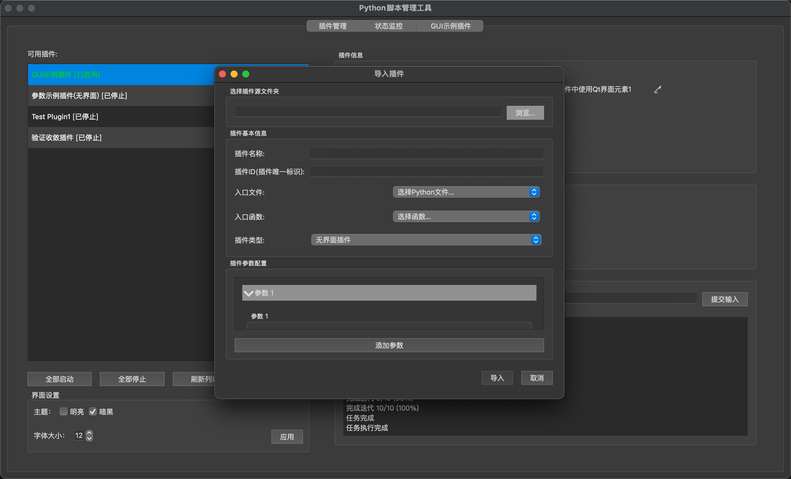

## GUI Manager

一个基于 PySide6 的脚本/插件图形化管理工具，提供插件管理、状态监控、主题与字体外观调节、插件导入等能力。

- 支持两类插件：无界面插件（BasePlugin）、UI 插件（BaseUIPlugin）
- 一键导入外部代码为插件，自动生成包装与参数面板
- 主题/字体即时生效并持久化，带状态监控页签
- 配置独立、日志可见、参数统一管理

文档：
- 插件开发指南：`docs/PLUGIN_DEVELOPMENT.md`
- 插件导入指南：`docs/PLUGIN_IMPORT_GUIDE.md`

### 环境与安装

- Python 3.10+
- 建议使用虚拟环境：

```bash
python -m venv .venv && source .venv/bin/activate  # Windows 使用 .venv\Scripts\activate
pip install -r requirements.txt
```

### 快速开始与运行

```bash
python GUI_Manager/main.py
```

若提示缺少 PySide6，请确认已激活虚拟环境并重新执行依赖安装。

启动后：
- 左侧为“可用插件”列表，可调整顺序；右侧为控制面板与日志/状态监控
- 点击“导入插件”可从现有目录快速导入（见“插件导入”）

### 功能特性

- 插件管理
  - 左侧“可用插件”列表，上下箭头调整顺序（顺序持久化）。
  - 右侧控制面板可启用/停用插件，支持自动启动、启动顺序。
  - 启用后为每个插件创建独立 Tab（有界面插件加载其 UI，无界面插件加载通用参数面板）。

- 状态监控
  - 独立“状态监控”页签，显示 GUI 状态与运行时间。
  - 表格前三列自适应拉伸填满，操作列固定宽度。
  - 支持“开启/关闭 GUI”“运行/停止 任务”。

- 界面设置
  - 主题：明亮/暗黑 两个复选框互斥单选，立即应用并保存。
  - 字体：选择字号后点击“应用”再生效，异步处理避免卡顿；全局更新并保存。

- 插件导入
  - “导入插件”对话框选择插件目录、入口文件与入口函数。
  - 递归复制目录（忽略隐藏项与 __pycache__），生成包装类与配置。
  - 运行时将插件目录临时加入 sys.path，支持同级导入（例如 `from moudleA import ModuleA`）。

### 程序截图




> 可在此处添加应用主界面与插件示例截图，方便新用户了解界面布局。

### 配置位置

- 主配置：`~/.config/GUI_Manager/main_config.yaml`（Windows 下位于 `%LOCALAPPDATA%/GUI_Manager/config`）
- 插件配置：`~/.config/GUI_Manager/plugins/`（每插件一个 yaml）

### 目录结构

```
GUI_Manager/
  GUI_Manager/
    app/
      main_window.py         # 主窗口与界面设置
      plugin_manager.py      # 插件基类/管理器
      plugin_importer.py     # 插件导入器
      status_monitor.py      # 状态监控页
    plugins/                 # 已导入插件目录
  README.md
  docs/PLUGIN_DEVELOPMENT.md      # 插件开发指南
  docs/PLUGIN_IMPORT_GUIDE.md     # 插件导入指南
  requirements.txt
```

### 常见问题

- 字体“SimHei”缺失提示：可忽略或安装中文字体，程序会自动回退可用字体。
- 插件内部导入失败：确认入口文件与被导入模块在同一目录或包结构正确。

### 贡献

欢迎提交 Issue 与 PR：
- 代码需通过基础 lint/格式检查
- 新功能请补充文档与必要的示例/截图

约定：遵循 Python 3.10+，尽量保持 UI 响应（耗时任务放后台线程，使用信号槽与 `is_stopped()` 协作）。

### 路线图

- [ ] 插件市场/索引展示
- [ ] 多语言支持（i18n）
- [ ] 更多参数控件类型与校验

### 许可证

MIT（示例项目，供学习与内部演示）

